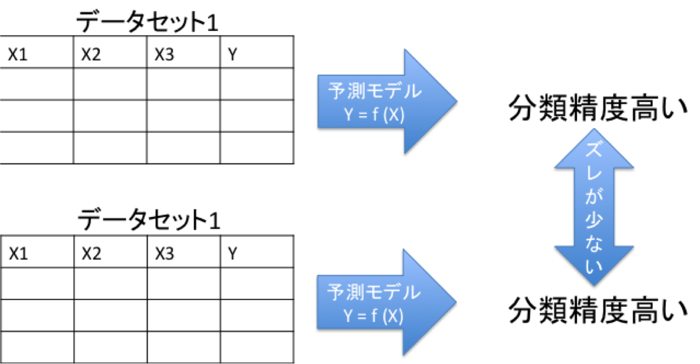

## outline {data-transition="slide-in fade-out" data-background=#ff6347}
  
- ### predictive model    
  
- ### CARET package  

- ### TRIPOD statement  


# predictive model

## 予測モデル
- predictive/prognostic model
- $$y= f(x)$$
```{r,asis=F}
library(DT)
datatable(head(iris,4),option=list(dom="t"))
```
- 説明変数(群)から目的変数を予測する
例) Sepal.LengthからPetal.Widthまでの変数で,Spiecies(種)を予測(分類)する

## 予測モデル  
### 予測モデル構築のためのモデルは色々ある

- 回帰モデル
- 決定木
- サポートベクターマシーン
- ナイーブベイズ
- 集団学習
- etc...

### どれを選ぶ？

## 予測(分類)精度の高いモデルが有益

- 予測が当たる
- 予測結果に安定性がある(誤差が少ない)  



> 異なるデータセットに同じモデルを当てはめても予測結果が大きく外れない


## 精度指標
- 感度
- 特異度
- ROC
- RSME
- etc...


### 精度指標に基づいて,  最適なモデルを選定しよう！

# Caretパッケージ {data-background-iframe="http://topepo.github.io/caret/index.html"}
  
  
  

***C***lassification ***A***nd ***Re***gression ***T***raining
  
url: http://topepo.github.io/caret/index.html

##  {data-background-iframe="http://topepo.github.io/caret/modelList.html"}


##　多様なモデルを統一の関数で
```{r, echo=F, message=F}
library(caret)
```

- gbm

```{r eval=F}
gbm.tune <- train(x=trainX,y=trainData$Class,
                  method = "gbm",
                  metric = "ROC",
                  trControl = ctrl,
                  #tuneGrid=grid,
                  verbose=FALSE,
                  preProc = c("center", "scale"))
```

- xgboot

```{r eval=F}
xgb.tune <- train(x=trainX,y=trainData$Class,
                  method = "xgbTree",
                  metric = "ROC",
                  trControl = ctrl,
                  #tuneGrid=grid,
                  verbose=FALSE,
                  preProc = c("center", "scale"))
```

##

- random forest

```{r eval=F}
RF.tune <- train(x=trainX,y=trainData$Class,
                  method = "rf",
                  metric = "ROC",
                  trControl = ctrl,
                  #tuneGrid=grid,
                  verbose=FALSE,
                  preProc = c("center", "scale"))
```


- naive bayes

```{r eval=F}
nb.tune <- train(x=trainX,y=trainData$Class,
                  method = "nb",
                  metric = "ROC",
                  trControl = ctrl,
                  #tuneGrid=grid,
                  verbose=FALSE,
                  preProc = c("center", "scale"))
```


## control

```{r, eval=F}
ctrl <- trainControl(method = "repeatedcv",   # 10fold cross validation
                     number = 5,							# do 5 repititions of cv
                     summaryFunction=twoClassSummary,	# Use AUC to pick the best model
                     classProbs=TRUE,
                     allowParallel = TRUE,
                     search="random")
```

-　機械学習のパラメータのセッティングは、超重要かつ色々と考えなきゃいけないとこがあるので、今回は割愛


##　複数の予測モデルの精度比較

```{r, echo=F}
load("caretCompare.Rdata")
```

```{r, eval=F}
rValues <- resamples(list(xgb=xgb.tune,
                          gbm=gbm.tune, 
                          RF=rf.tune, 
                          NB=nb.tune))
```

-  

##　プロットして精度を比較
```{r}
bwplot(rValues,layout = c(3, 1),
       main="GBM vs xgboost vs RF vs NB",
       xlim=c(0.70,1.00))	
```


##　予測モデルの教科書  {data-background-iframe="http://appliedpredictivemodeling.com/"}


## 予測モデルのレポーティングガイド {data-background-iframe="https://www.tripod-statement.org/"}
